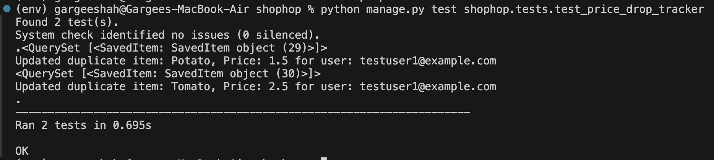

The tests in this module ensure that all the feature is functioning correctly by testing different functionalities of the price comparison process.

## Key tests for Price Comparison:  
[backend/shophop/shophop/tests/test_price_comparison.py](backend/shophop/shophop/tests/test_price_comparison.py)  
command: `python manage.py test shophop.tests.test_price_comparison`
1. Basic API Check:

    Objective: Verify that the price comparison API returns a successful response when queried with a product name.  
    Tested by: `test_fetch_products_basic_api_check`  
    Checks:  
    &nbsp;Returns a 200 OK status.  
    &nbsp;Response is in the form of a list.  
    &nbsp;Verifies that products from Aldi, Walmart and Target are present.
    

2. Handling Non-Existing Product Query:

    Objective: Ensure that the API gracefully handles requests for non-existent products and responds appropriately.  
    Tested by: `test_fetch_single_product_with_nonexisting_data`  
    Checks:  
    &nbsp;Returns a 200 OK status and 'No product found' response body.  
    &nbsp;Ensures the API can handle queries with no results without errors.
    

3. Multiple Products Query:

    Objective: Test the API when querying for multiple products at once.  
    Tested by: `test_multiple_products`  
    Checks:  
    &nbsp;Verifies that the API can handle and return valid responses for queries involving multiple products.  
    Response -
   
4. Data Cleaning (Removing Invalid Data):  
    
    Objective: Ensure that only valid and complete product data is included in the response.  
    Tested by: `test_only_show_data_having_all_fields`  
    Checks:  
    &nbsp;Verifies that missing or invalid data (such as None in critical fields like Price or Product) is properly cleaned before being processed further.  
    &nbsp;Ensures that no null values remain in the cleaned dataset.

5. Standardizing Quantities:  
    
    Objective: Verify that product quantities are standardized to a consistent format (e.g., converting units to "oz", "ct", etc.).  
    Tested by: `test_valid_quantities`: Ensures that the quantities are standardized correctly.  
    `test_standard_quantity_null_drop`: Verifies that rows with invalid or missing quantities are dropped.  
    Checks:  
    &nbsp;Ensures that product quantities are correctly standardized.  
    &nbsp;Ensures that rows with invalid or missing quantities are appropriately handled.  
    Example: Converting 'gal' to 'oz'  
    

6. Price Sorting and Comparison:

    Objective: Test the price comparison and sorting functionality.  
    Tested by: `test_price_comparison`  
    Checks:  
    &nbsp;Verifies that the price comparison sorts the products correctly by store and Price in ascending order.    
    &nbsp;Uses pandas.testing.assert_frame_equal to compare the sorted data with the expected result.

Running all test cases -

## Key test for Price Drop Tracker:  
We implemented a cron job scheduled to run weekly, designed to monitor and notify users of any price drops on their saved items being tracked.  

Database of user's saved items -   
    

For testing purposes, we scheduled the cron job to run every 3 minutes and manually updated the database by increasing the price of a specific item.  
  

User table - To determine the mailing list for notifying users about price drops, we analyze the User table.  
  

Since the price of "Banana" is higher for User ID 1, the mailing list should include data for User ID 1, as shown in the provided Mailing List screenshot. This ensures that only relevant users, such as User ID 1 in this case, are notified based on their saved item price changes. 
  

Lastly, database of user's saved item gets updated with new cheap price -  
  

When there are no updates (i.e., no price drops or cheaper products found), the mailing list will be empty, meaning no users will receive notifications.  
  

The price comparison for the price drop tracker runs automatically every 3 minutes via a cron job, and logs are generated in the cron_test.log file. It checks for price drops, updates the mailing list, and sends notifications only when a price change is detected. If no price drops are found, no emails are sent.  
  

When there is a price drop for items in the price tracking list, the respective users will receive a notification email.  
  

## Key test for Recipe Recommendation:  
[frontend/pages/test/test_recipe_recommender.py](frontend/pages/test/test_recipe_recommender.py)

### 1. test_get_function_successful()
Checks for a successful recipe recommendation generation
It creates a mock test with ingredients such as chicken, tomatoes, and pasta ans tt uses patch() to simulate a successful API response. It will simulate the Ollama API call to return a predefined recipe response. It ensures that the core functionality of recipe generation works correctly under normal conditions.

Assertions:
It checks that the result is not an empty string.
It verifies that all the inputted ingredients are mentioned in the result.
 

### 2. test_empty_ingredients()
Tests behavior when no ingredients are provided
Calls get_recipe_recommendations() with an empty list and validates error handling for edge cases with no input

Assertions:
Expects an error message to be present in the result

### 3. test_single_ingredient()
Checks functionality with minimal input (single ingredient)
Mocks API response for a single ingredient (chicken) and simulates recipe generation with just one ingredient. It ensures the system can handle minimal input scenarios

Assertions:
Verifies the result is a non-empty string

### 4. test_api_error()
Validates error handling when the API call fails
Simulates an API request exception and  uses side_effect to raise a RequestException. It ensures proper handling of external service failures

Assertions:
Checks for an error message in the returned result

### 5. test_input_sanitization()
Tests input cleaning and normalization
Provides ingredients with extra spaces and mixed case and mocks an API response. It ensures proper handling of inconsistent input formatting

Assertions:
Verifies the result is a valid, non-empty string

### 6. test_special_characters()
Checks handling of ingredients with special characters
Provides ingredients with special characters (chicken!, tomato@, pasta#) and mocks an API response. 

Assertions:
Verifies the result is a valid, non-empty string

### 7. test_single_character_ingredients()
Ensures single-character "ingredients" are filtered out
Provides input with single-character entries and a valid ingredient using validate_ingredients() function. It prevents potentially malicious inputs or inputs that dont make sense

Assertions:
Checks that only valid ingredients remain
Ensures that ingredients with just one character are filtered out

### 8. test_numeric_ingredients()
Filters out numeric-only inputs
Provides input with numeric strings and a valid ingredient. Prevents irrelevant numeric inputs from being processed

Assertions:
Ensures numeric-only "ingredients" are filtered out

### 9. test_symbol_ingredients()
Removes entries that are purely symbols
Provides input with symbol-only entries and a valid ingredient. Filters out ingredients that are only symbols

Assertions:
Verifies only 'ingredients' are retained

### 10. test_repeated_ingredients()
Handles repeated entries of ingredients
Provides input with repeated ingredients. Ensures duplicate ingredients are removed

Assertions:
Checks that duplicates have been removed
Checks correct number and set of unique ingredients

### 11. test_extreme_length()
Tests very long ingredient inputs
Creates a really long random ingredient and appends a valid ingredient to the randomly generated ingredient. This prevents any buffer overflow or performance issues from happening.

Assertions:
Checks that only valid ingredients are retained

### 12. test_malicious_prompt_injection()
Prevents possible prompt injection attacks
Provides inputs containing suspicious phrases and tries to inject malicious commands. This adds a security layer against potential AI manipulations via prompts

Assertions:
Ensures no suspicious inputs pass through
Removes potentially dangerous input elements

### 13. test_whitespace_variations()
Handles different whitespace cases
Ingredients are provided with irregular spacing. It ensures that the input is parsing properly.

Assertions:
Checks the right extraction of ingredients
Checks that spacing is handled accordingly

### 14. test_case_sensitivity()
Test case handling of ingredients
Provide ingredients in mixed case. It verifies that the input is case-insensitive for comparison but preserves original casing. This ensures input consistency during processing.

Assertions:
Original casing is maintained

### 15. test_unicode_characters()
Test non-ASCII character support
Provide ingredients with unicode and special characters. This enables diverse input support

Assertions:
All valid ingredients are retained

### 16. test_max_ingredient_limit()
Test handling for too many ingredients provided
Generates a huge number of ingredients. It prevents resource exhaustion and maintains performance

Assertions:
Ensures a decent maximum limit is enforced

### 17. test_empty_or_whitespace()
Completely empty or whitespace-only inputs
Provides various empty or whitespace inputs. Allowing it to properly handle any null or empty inputs

Assertions:
Verifies that no null or empty inputs ingredients are extracted/parsed

## Key test for Price Tracking DB:  
[backend/shophop/shophop/tests/test_price_drop_tracker.py](backend/shophop/shophop/tests/test_price_drop_tracker.py)  
command: python manage.py test shophop.tests.test_price_drop_tracker

1. Updating Saved items list for users:  
    Objective: To test the function update_saved_items_db and ensure that it correctly updates the saved items' prices in the database based on the mailing list  
    Tested by: `test_update_saved_items_db`  
    Checks:  
    &nbsp;Verify that the price of "Potato" for user1 is updated from 2.0 to 1.5.  
    &nbsp;Verify that the price of "Tomato" for user1 is updated from 3.0 to 2.5.  
    &nbsp;Ensure the database reflects these updates.

2. Fetching Saved Items for users from the db:  
    Objective: To test the function get_users_saved_data and ensure that it returns the correct saved data for all users in the expected format.  
    Tested by: `test_get_users_saved_data`  
    Checks:  
    &nbsp;Verify that the result contains all the saved items with correct user associations.  
    &nbsp;Ensure the returned result matches the expected structure with user email, item name, and price.  

All tests - 
  
  
## Key test for User Authentication and Authorization:  
[frontend/test/test_utils.py](frontend/test/test_utils.py)  
