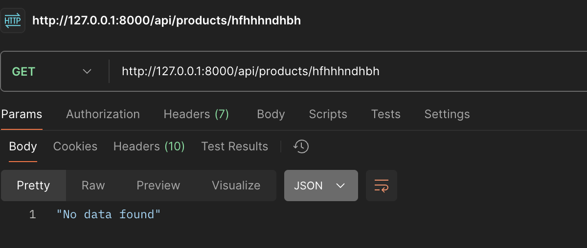

The tests in this module ensure that all the feature is functioning correctly by testing different functionalities of the price comparison process.

## Key tests for Price Comparison:  
[backend/shophop/shophop/tests/test_price_comparison.py](backend/shophop/shophop/tests/test_price_comparison.py)
1. Basic API Check:

    Objective: Verify that the price comparison API returns a successful response when queried with a product name.  
    Tested by: `test_fetch_products_basic_api_check`  
    Checks:  
    &nbsp;Returns a 200 OK status.  
    &nbsp;Response is in the form of a list.  
    &nbsp;Verifies that products from Aldi, Walmart and Target are present.
    

2. Handling Non-Existing Product Query:

    Objective: Ensure that the API gracefully handles requests for non-existent products and responds appropriately.  
    Tested by: `test_fetch_single_product_with_nonexisting_data`  
    Checks:  
    &nbsp;Returns a 200 OK status and 'No product found' response body.  
    &nbsp;Ensures the API can handle queries with no results without errors.
    

3. Multiple Products Query:

    Objective: Test the API when querying for multiple products at once.  
    Tested by: `test_multiple_products`  
    Checks:  
    &nbsp;Verifies that the API can handle and return valid responses for queries involving multiple products.  
    Response -
   
4. Data Cleaning (Removing Invalid Data):  
    
    Objective: Ensure that only valid and complete product data is included in the response.  
    Tested by: `test_only_show_data_having_all_fields`  
    Checks:  
    &nbsp;Verifies that missing or invalid data (such as None in critical fields like Price or Product) is properly cleaned before being processed further.  
    &nbsp;Ensures that no null values remain in the cleaned dataset.

5. Standardizing Quantities:  
    
    Objective: Verify that product quantities are standardized to a consistent format (e.g., converting units to "oz", "ct", etc.).  
    Tested by: `test_valid_quantities`: Ensures that the quantities are standardized correctly.  
    `test_standard_quantity_null_drop`: Verifies that rows with invalid or missing quantities are dropped.  
    Checks:  
    &nbsp;Ensures that product quantities are correctly standardized.  
    &nbsp;Ensures that rows with invalid or missing quantities are appropriately handled.  
    Example: Converting 'gal' to 'oz'  
    

6. Price Sorting and Comparison:

    Objective: Test the price comparison and sorting functionality.  
    Tested by: `test_price_comparison`  
    Checks:  
    &nbsp;Verifies that the price comparison sorts the products correctly by store and Price in ascending order.    
    &nbsp;Uses pandas.testing.assert_frame_equal to compare the sorted data with the expected result.

Running all test cases -

## Key test for Price Drop Tracker:  
We implemented a cron job scheduled to run weekly, designed to monitor and notify users of any price drops on their saved items being tracked.  

Database of user's saved items -   
    

For testing purposes, we scheduled the cron job to run every 3 minutes and manually updated the database by increasing the price of a specific item.  
  

User table - To determine the mailing list for notifying users about price drops, we analyze the User table.  
  

Since the price of "Banana" is higher for User ID 1, the mailing list should include data for User ID 1, as shown in the provided Mailing List screenshot. This ensures that only relevant users, such as User ID 1 in this case, are notified based on their saved item price changes. 
  

Lastly, database of user's saved item gets updated with new cheap price -  
  

When there are no updates (i.e., no price drops or cheaper products found), the mailing list will be empty, meaning no users will receive notifications.  
  

The price comparison for the price drop tracker runs automatically every 3 minutes via a cron job, and logs are generated in the cron_test.log file. It checks for price drops, updates the mailing list, and sends notifications only when a price change is detected. If no price drops are found, no emails are sent.  
  

When there is a price drop for items in the price tracking list, the respective users will receive a notification email.  
  

## Key test for Recipe Recommendation:  
[frontend/pages/test_recipe_recommender.py](frontend/pages/test_recipe_recommender.py)
