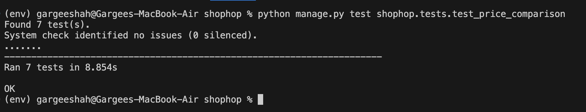

The tests in this module ensure that all the feature is functioning correctly by testing different functionalities of the price comparison process.

* Key tests for Price Comparison:
1. Basic API Check:

    Objective: Verify that the price comparison API returns a successful response when queried with a product name.  
    Tested by: `test_fetch_products_basic_api_check`  
    Checks:  
    &nbsp;Returns a 200 OK status.  
    &nbsp;Response is in the form of a list.  
    &nbsp;Verifies that products from Aldi, Walmart and Target are present.
    

2. Handling Non-Existing Product Query:

    Objective: Ensure that the API gracefully handles requests for non-existent products and responds appropriately.  
    Tested by: `test_fetch_single_product_with_nonexisting_data`  
    Checks:  
    &nbsp;Returns a 200 OK status and 'No product found' response body.  
    &nbsp;Ensures the API can handle queries with no results without errors.
    

3. Multiple Products Query:

    Objective: Test the API when querying for multiple products at once.  
    Tested by: `test_multiple_products`  
    Checks:  
    &nbsp;Verifies that the API can handle and return valid responses for queries involving multiple products.  
    Response -
   
4. Data Cleaning (Removing Invalid Data):  
    
    Objective: Ensure that only valid and complete product data is included in the response.  
    Tested by: `test_only_show_data_having_all_fields`  
    Checks:  
    &nbsp;Verifies that missing or invalid data (such as None in critical fields like Price or Product) is properly cleaned before being processed further.  
    &nbsp;Ensures that no null values remain in the cleaned dataset.

5. Standardizing Quantities:  
    
    Objective: Verify that product quantities are standardized to a consistent format (e.g., converting units to "oz", "ct", etc.).  
    Tested by: `test_valid_quantities`: Ensures that the quantities are standardized correctly.  
    `test_standard_quantity_null_drop`: Verifies that rows with invalid or missing quantities are dropped.  
    Checks:  
    &nbsp;Ensures that product quantities are correctly standardized.  
    &nbsp;Ensures that rows with invalid or missing quantities are appropriately handled.  
    Example: Converting 'gal' to 'oz'  
    

6. Price Sorting and Comparison:

    Objective: Test the price comparison and sorting functionality.  
    Tested by: `test_price_comparison`  
    Checks:  
    &nbsp;Verifies that the price comparison sorts the products correctly by store and Price in ascending order.    
    &nbsp;Uses pandas.testing.assert_frame_equal to compare the sorted data with the expected result.

* Key test for Price Drop Traker: